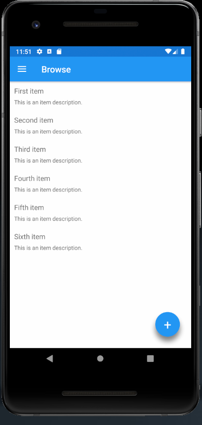

# ThunderDesign.Xamarin.Forms.FloatingActionButton
[](https://github.com/ThunderDesign/ThunderDesign.Xamarin.Forms.FloatingActionButton/actions/workflows/CI.yml)
[](https://github.com/ThunderDesign/ThunderDesign.Xamarin.Forms.FloatingActionButton/actions/workflows/CD.yml)
[](https://www.nuget.org/packages/ThunderDesign.Xamarin.Forms.FloatingActionButton)
[](https://github.com/ThunderDesign/ThunderDesign.Xamarin.Forms.FloatingActionButton/blob/main/LICENSE)
[](https://github.com/ThunderDesign/ThunderDesign.Xamarin.Forms.FloatingActionButton/blob/main/README.md)

FloatingActionButton (FAB) with custom shadow (Color, Offset, Blur) and custom Animation Easing (Show, Hide) for Xamarin.Forms view (Android, iOS, UWP)

----

| Supported platforms        |
|----------------------------|
| :heavy_check_mark: Android |
| :heavy_check_mark: iOS     |
| :heavy_check_mark: UWP     |



## Getting Started:

### Sample
After installation, start using the features you're after.

If you're using XAML, you can add this namespace to your root node to get access to the FAB: `xmlns:fab="clr-namespace:ThunderDesign.Xamarin.Forms.FloatingActionButton.Controls;assembly=ThunderDesign.Xamarin.Forms.FloatingActionButton"`.

```XML
<fab:FloatingActionButton
  Text="+"
  Style="{StaticResource RoundFAB}"
  Command="{Binding NewItemCommandAsync}"		
  VerticalOptions="End"
  HorizontalOptions="End"
  Margin="25"/>
```

### Sample Style (same as Button)

```XML
<Style x:Key="RoundFAB" TargetType="fab:FloatingActionButton">
    <Setter Property="TextColor" Value="White"></Setter>
    <Setter Property="FontSize" Value="30"></Setter>
    <Setter Property="WidthRequest" Value="56"></Setter>
    <Setter Property="HeightRequest" Value="56"></Setter>
    <Setter Property="CornerRadius" Value="28"></Setter>
</Style>

<Style TargetType="fab:FloatingActionButton">
    <Setter Property="VisualStateManager.VisualStateGroups">
        <VisualStateGroupList>
            <VisualStateGroup x:Name="CommonStates">
                <VisualState x:Name="Normal">
                    <VisualState.Setters>
                        <Setter Property="BackgroundColor" Value="{StaticResource Primary}" />
                    </VisualState.Setters>
                </VisualState>
                <VisualState x:Name="Disabled">
                    <VisualState.Setters>
                        <Setter Property="BackgroundColor" Value="#332196F3" />
                    </VisualState.Setters>
                </VisualState>
            </VisualStateGroup>
        </VisualStateGroupList>
    </Setter>
</Style>
```

----

## Installation

Grab the latest [ThunderDesign.Xamarin.Forms.FloatingActionButton NuGet](https://www.nuget.org/packages/ThunderDesign.Xamarin.Forms.FloatingActionButton) package and install in your solution.

> Install-Package ThunderDesign.Xamarin.Forms.FloatingActionButton

Use the `-version` option to specify an [older version](https://www.nuget.org/packages/ThunderDesign.Xamarin.Forms.FloatingActionButton#versions-tab) to install.

### Platforms
- Android 
  - You will need to add the NuGet package to your *.NET Standard library project*
- iOS
  - **Important:** You will need to add the NuGet package to **both** your *.NET Standard library project* and your *platform-dependent iOS project*.
  - modify `AppDelegate.cs` and add `Sharpnado.Shades.iOS.iOSShadowsRenderer.Initialize();`

    ```csharp
    public override bool FinishedLaunching(UIApplication app, NSDictionary options)
    {
        ...
        global::Xamarin.Forms.Forms.Init();
        Sharpnado.Shades.iOS.iOSShadowsRenderer.Initialize();
        LoadApplication(new App());
        ...
    }
    ```
- UWM
  - **Important:** You will need to add the NuGet package to **both** your *.NET Standard library project* and your *platform-dependent UWM project*.
  - modify `App.xaml.cs` and add `var rendererAssemblies = new[] { typeof(UWPShadowsRenderer).GetTypeInfo().Assembly };`

    ```csharp
    protected override void OnLaunched(LaunchActivatedEventArgs e)
    {
        ...
        global::Xamarin.Forms.Forms.SetFlags("Shell_UWP_Experimental");
        var rendererAssemblies = new[] { typeof(UWPShadowsRenderer).GetTypeInfo().Assembly }; 
        Xamarin.Forms.Forms.Init(e);
        ...
    }
    ```

## Examples

*(TIP: Clone repo, open the solution, build it and run sample app.)*
- Xamarin
  - [SimpleItems Example](https://github.com/ThunderDesign/ThunderDesign.Xamarin.Forms.FloatingActionButton/tree/main/samples/Xamarin/SimpleItems)

## Please Contribute!

This is an open source project that welcomes contributions/suggestions/bug reports from those who use it. If you have any ideas on how to improve the library, please [post an issue here on GitHub](https://github.com/ThunderDesign/ThunderDesign.Xamarin.Forms.FloatingActionButton/issues). Please check out the [How to Contribute](https://github.com/ThunderDesign/ThunderDesign.Xamarin.Forms.FloatingActionButton/blob/main/.github/CONTRIBUTING.md).

